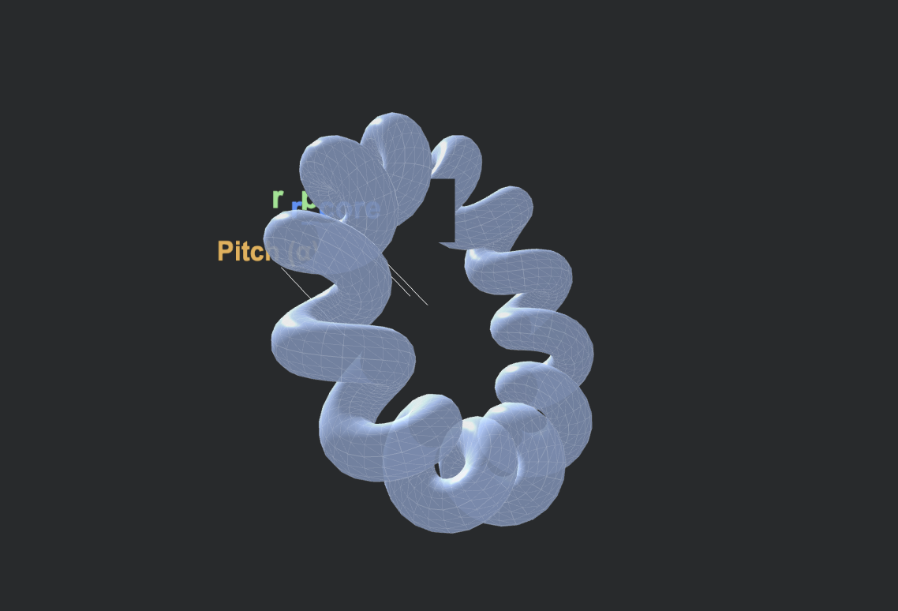
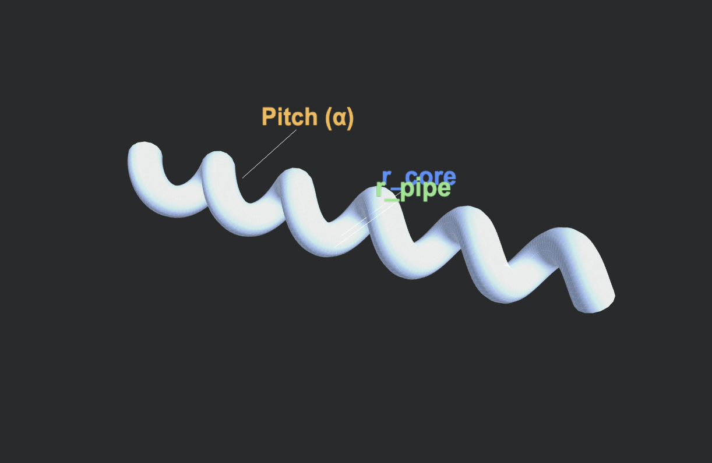

> © 2026 Vismay Malondkar. **Universal Plumbing Theory (UPT)**. Licensed under [CC BY 4.0](https://creativecommons.org/licenses/by/4.0/).

# Universal Plumbing Theory (v4.0)
Make physics flow again.

This repository treats the universe as a purely deterministic, local, **fluid-mechanical engineering system**. By replacing point particles and "Spacetime" with **3D Fluid Knots** and a high-density **Compressible Acoustic Superfluid**, the anomalies of both Quantum Mechanics and General Relativity resolve themselves. We don't need "new physics" or extra dimensions; we just need to fix the leaks.

---

## Core Architecture (The Foundation)

To run this universe, you only need to accept three physical material specifications:

1. **The Absolute Medium (The Ocean):** Space is not an empty void. It is a frictionless, continuous, high-density ($\rho \approx 10^{11} \text{ kg/m}^3$) acoustic superfluid. It exists under a massive, crushing baseline static pressure ($P_0$). The speed of light ($c$) is simply Mach 1—the absolute acoustic speed limit of this medium.
2. **The Standard Pipe ($r_{pipe}$):** There are no "fundamental particles." Matter is simply a standard fluid vortex tube—a Toroidal Helix—measuring exactly $\approx 10^{-15} \text{ m}$ thick. It is stabilized against the crushing ocean because its internal fluid spins violently at exactly $c$.
3. **The Kinematic Shear Limit ($G$ & $r_{core}$):** Because the fluid is perfectly frictionless, standard Euler math says the ambient pressure should crush the vortex core down to a 0-dimensional point. It doesn't. The empirical value of $G$ is not a gravitational constant; it is the universal fluid's maximum shear threshold. This threshold permanently halts the collapse, locking the dead-center of every pipe into a stable, indestructible vacuum pinhole measuring exactly $\approx 10^{-38} \text{ m}$ ($r_{core}$).

From these foundational rules, all "mysteries" of physics emerge as strictly deterministic plumbing consequences.

## The Mechanics (Emergent Properties)

### **1. Mass is an Illusion (The Continuous Integral)**
Legacy physics treats mass as a fundamental "stuff" and uses $E=mc^2$ to imply mass creates energy. The UPT reverses the arrow of causality: $\mathbf{m = E/c^2}$. 
There is no such thing as mass. A particle is simply a continuous $1/r$ velocity gradient in the fluid. The Total Energy ($E$) of a particle is strictly the **Volume Integral** of its local kinetic spin and pressure displacement. When you integrate that massive localized storm, the resulting hydrodynamic inertia violently resists acceleration. This emergent resistance is what human scales mistakenly measure as "Mass." 

### **2. The Hierarchy Problem Solved (The Aperture Ratio)**
Gravity and Electromagnetism are governed by the exact same classical fluid displacement equation. The $10^{40}$ "Hierarchy Problem" is simply a geometric division-by-zero error caused by legacy physics treating particles as points instead of pipes. 
* **Electromagnetism (Strong):** The field is generated by the physical drag of the macroscopic containment wall ($r_{pipe} \approx 10^{-15} \text{ m}$).
* **Gravity (Weak):** The Bernoulli suction is strictly choked by the microscopic vacuum pinhole at the dead center ($r_{core} \approx 10^{-38} \text{ m}$).
The $10^{45}$ baseline force discrepancy emerges cleanly from dividing the two physical apertures.

### **3. The Nature of Light (The Acoustic Ramjet)**
Standard quantum mechanics treats light as a 0-dimensional, paradoxical "wave-particle." The UPT defines light strictly as a physical, 3D fluid-dynamic structure. When a matter knot is destroyed, it unspools into an open Toroidal Helix. Retaining its immense angular momentum, this open spring is propelled through the universal ocean at the absolute acoustic speed limit ($c$), surviving as a perfectly balanced mechanical Ramjet. 

* **Zero Rest Mass:** Because the open pipe is flying at exactly $c$, the resting ocean is rammed straight down the $r_{core}$ vacuum tube at the speed of sound. This longitudinal fluid intake 100% satisfies the internal vacuum, completely neutralizing the radial Bernoulli suction we experience as "Gravity" or "Mass." 
* **$E = hf$ is Classical Impact:** Planck's Constant ($h$) is not a magical quantum unit; it is simply the baseline gyroscopic inertia of one full $360^\circ$ rotation of the universal fluid pipe. Frequency ($f$) is the mechanical RPM of the flying spring. The equation is just classical power delivery: Total Energy = (Inertia of one coil) $\times$ (Coils per second).
* **The Geometric Ceiling (220 MeV):** Because the photon is a physical coiled spring, it has a strict maximum capacity. As energy increases, the coils pack tighter together. If a single spring attempts to carry more than 220 MeV, the distance between the coils ($\lambda$) shrinks below the physical thickness of the fluid wire itself ($5.634 \times 10^{-15} \text{ m}$). The spring hits "Solid Height," intersects, and shatters. Light has a hardcoded structural ceiling.
* **The Double-Slit Resolution:** As the physical spring flies forward, it displaces the dense universal ocean, creating a massive Mach 1 acoustic bow wave. In the double-slit experiment, the microscopic spring goes through one slit, while its massive acoustic wake spills through both. The overlapping wake on the other side creates lateral fluid pressure that physically steers the spring into interference bands.

